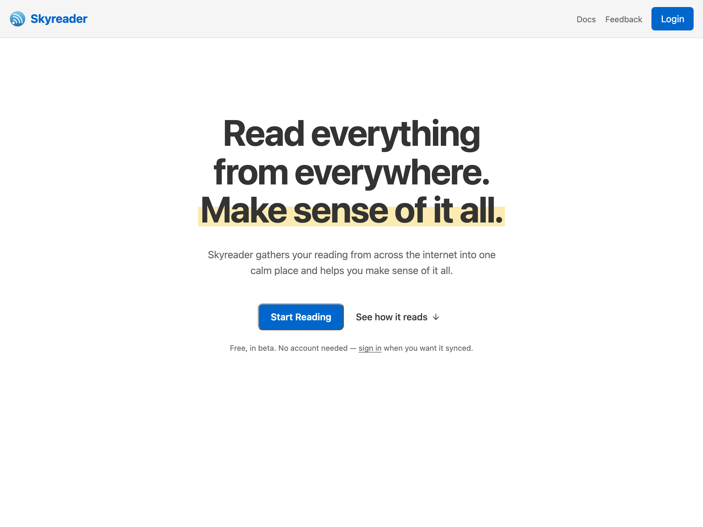

## Read first, sign in later

On [skyreader.app](https://skyreader.app), **Start Reading** opens a guest library: a curated set of feeds you can read right away, no account needed. As a guest you can read, mark things read, save articles, highlight, and build a daily magazine. Everything stays on your device.

Logging in with an account allows you to add your own feeds, sync across devices, share to your linkblog, and save articles to Semble or Margin.

## Signing in

Skyreader uses your **Atmosphere account**: the login for the open network Skyreader runs on. Your account lives with a provider you choose, not locked inside one app. Bluesky is the most popular provider, so for most people this means typing their Bluesky handle (like `you.bsky.social`), but any provider works.

If you're new to the Atmosphere, the sign-in page has a sign-up path that creates an account with the provider of your choice.

There is no separate Skyreader password. Sign-in happens on your provider's page, and Skyreader never sees your credentials.

Occasionally Skyreader will ask you to log in again to grant access for a specific feature, such as backing your saves with Semble or Margin. That is your provider confirming a new permission, not an error.

## Finding your way around

- **Home** is the front page: your reading, resumable where you left off.
- **Feeds** is the full library, with the sidebar of sources and channels.
- **Saved** holds articles you've saved, from your feeds or from anywhere on the web.
- **Daily** is your magazine, built from your saves. See [Reading](/guide/reading/).
- **Highlights** collects every passage you've highlighted, with a review deck.
- **Linkblog** is where your shared links live. See [Sharing](/guide/sharing-and-your-linkblog/).

## Installing the app

Skyreader is a web app you can install:

- **iPhone / iPad:** in Safari, Share, then **Add to Home Screen**.
- **Android:** in Chrome, menu, then **Add to Home screen** (or **Install app**). Once installed, Skyreader appears in the system share sheet, so you can save articles from any app.
- **Desktop:** Chrome and Edge show an install icon in the address bar.

Installed or not, the app works offline: your feeds, saves, and highlights are stored locally, and anything you do offline syncs when you reconnect.
