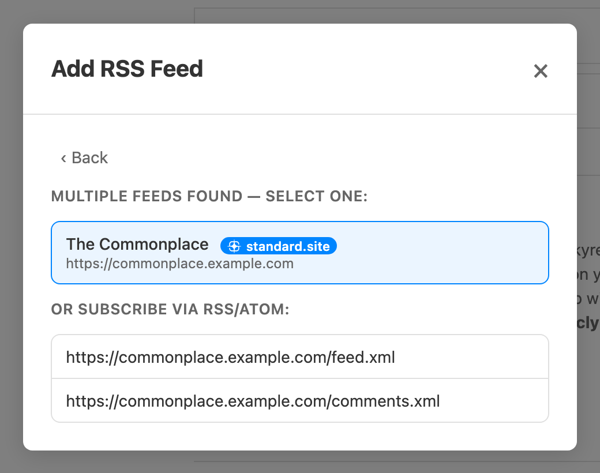

Skyreader reads two kinds of sources today:

- **RSS and Atom feeds**: any blog, news site, or site that publishes a feed.
- **standard.site publications**: writing published on the Atmosphere, from apps like Leaflet.

More sources (like email newsletters) are on the roadmap.

## Add a feed

Use the **+** button and choose **Add RSS Feed**. Paste any page URL, or just a domain; Skyreader finds the feeds on that page. One match subscribes you directly, several gives you a picker. When a site publishes both a standard.site publication and an RSS feed, the publication is listed first, since it usually carries the full text.

## Follow a person

**Add @handle** follows an Atmosphere account (Bluesky, Blacksky, and others). Search by handle or name, pick the account, and Skyreader finds their standard.site publications for you to subscribe to.

## Import and export

**Settings → Import / Export** takes an OPML file, or a plain text file with one feed URL per line. You pick which feeds to bring in; duplicates are skipped automatically. **Export OPML** hands your whole subscription list back at any time. Your feeds are never locked in.

## Save and subscribe from anywhere

You don't have to be in Skyreader to add to it:

- **[Chrome extension](https://chromewebstore.google.com/detail/skyreader/kdefpnnpmajcclfepekgdkcdiklfooed):** a toolbar button that saves the page you're reading and lists the feeds it publishes, each with a subscribe button.
- **Bookmarklets** (desktop): drag **Save to Skyreader** and **Subscribe in Skyreader** from **Settings → Save from anywhere** to your bookmarks bar.
- **iPhone / iPad:** add the Save and Subscribe shortcuts from the same settings section; they appear in the share sheet.
- **Android:** install Skyreader to your home screen and it appears in the system share sheet.

## Discover

The **Discover** page suggests linkblogs and standard.site publications owned by the accounts you follow on Bluesky.

## Channels

Channels group your library into views: by topic, by kind of source, or by any filter you like. Skyreader suggests some (a Newsletters channel for your newsletter-ish feeds, for example) and you can create your own. See [Reading](/guide/reading/).

## Limits

The free plan includes 100 active feeds. Supporters get 1,000. See [Supporter](/supporter/).
