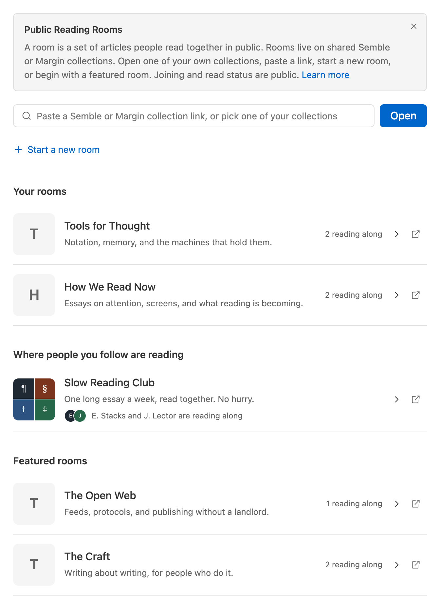
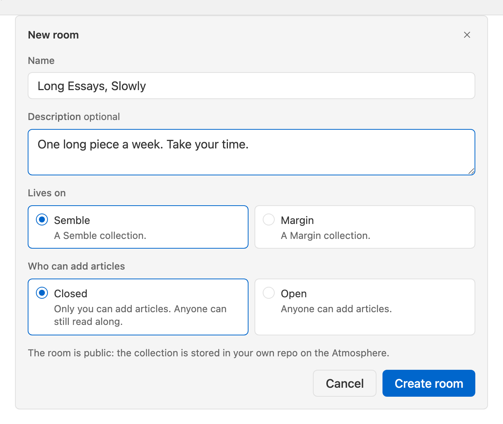
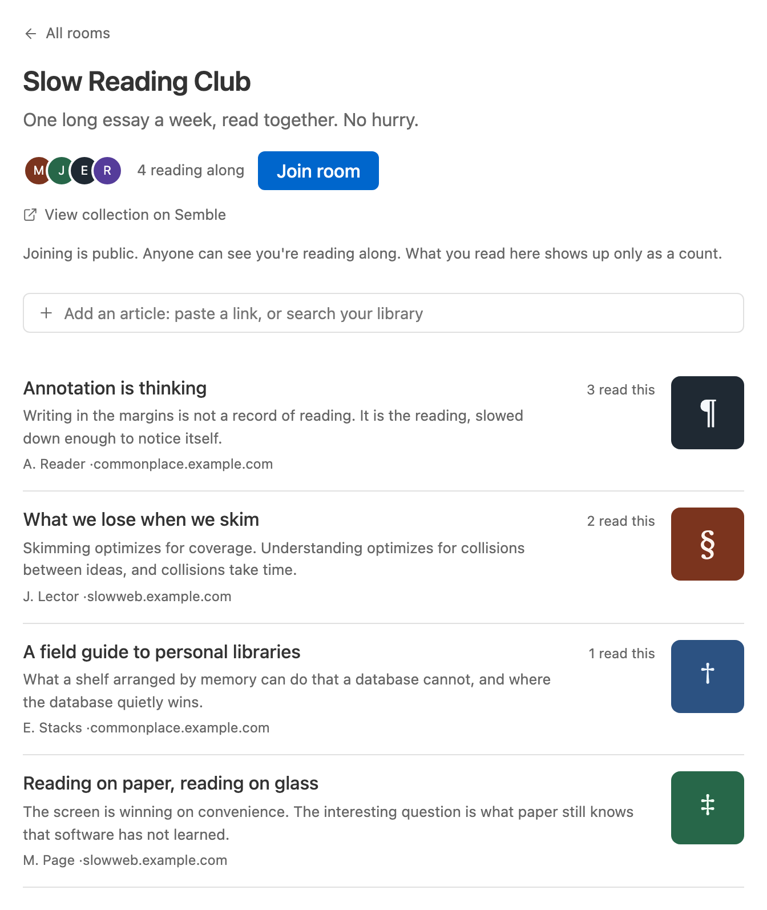

A reading room is a set of articles people read together. It shows who is reading along and how many people have read each piece, so a list feels less like a queue and more like a room with people in it.

## Where rooms come from

A room is a public [Semble](https://semble.so) or [Margin](https://margin.at) collection. Any collection in either app can be opened as a room. You can also start a room from Skyreader, which creates the collection for you.

**Rooms** in the sidebar lists the rooms you've joined, the rooms people you follow on Bluesky are reading in, and a few featured rooms.

To open any other room, paste a room link, or a Semble or Margin collection link, into the box at the top, or click into the box and pick one of your own collections.

## Starting a room

**Start a new room** creates a semble or margin collection in your own repo. Give it a name and an optional description. 

A Semble room can be **closed** or **open**. Closed means only you can add the articles. Open means anyone can add new articles. Either way, anyone can read along. A Margin room is always closed, because Margin collections have no open setting.

## Joining

**Join room** on a room page adds you to the people reading along. Joining is public: it writes a record to your PDS, so anyone can see you're reading along, in Skyreader or in any Atmospheric app. **Leave room** deletes that record.

Joining is what puts your avatar on the room page and adds the room to **Home** as its own lane. Someone who follows you will also see the room under **Where people you follow are reading** on their Rooms page.

## Reading in a room

Open an article from the room to read it like any other article. When you finish, **Mark as read** at the end of the article will share your read status with everyone.

## Adding articles

If the collection allows it, the room carries an add box above its list: paste a link, or search your Saved library as you type. Who may add is the collection's own rule. An open Semble collection takes additions from anyone; a closed one from its owner and collaborators; a Margin collection from its owner only.

## What's public

- **Joining** is public, to the whole Atmosphere.
- **Articles you add** are public records in your PDS.
- **What you read** in a room shows up only as an anonymous count inside Skyreader.

Rooms don't change anything else: your read state, saves, and highlights stay private as described in [Your data](/your-data/).
