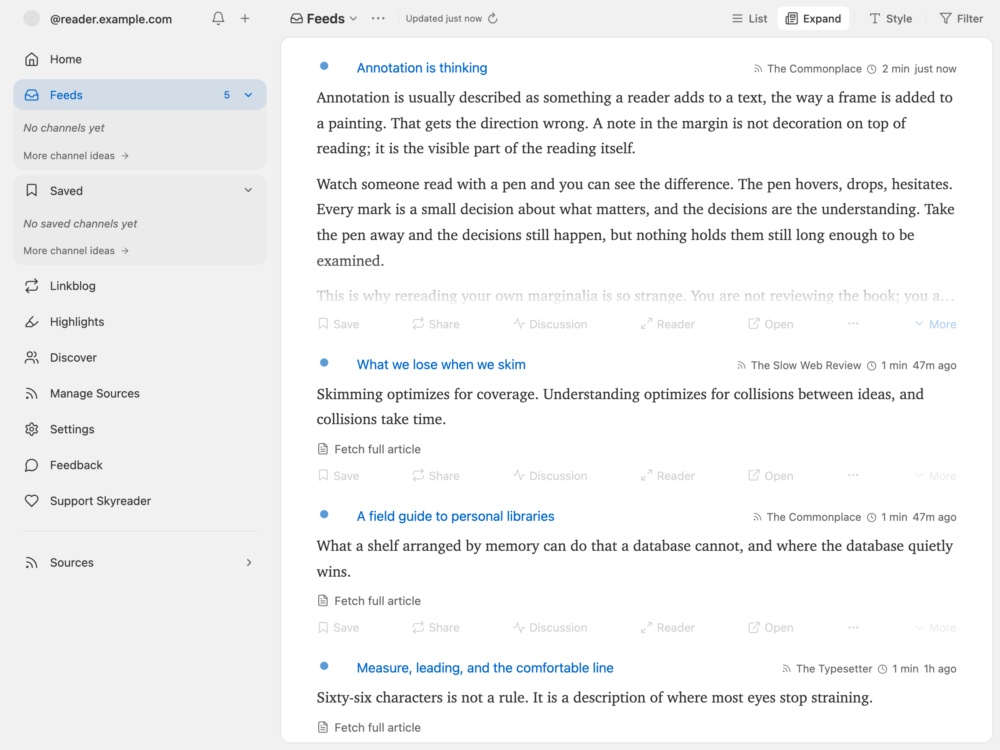
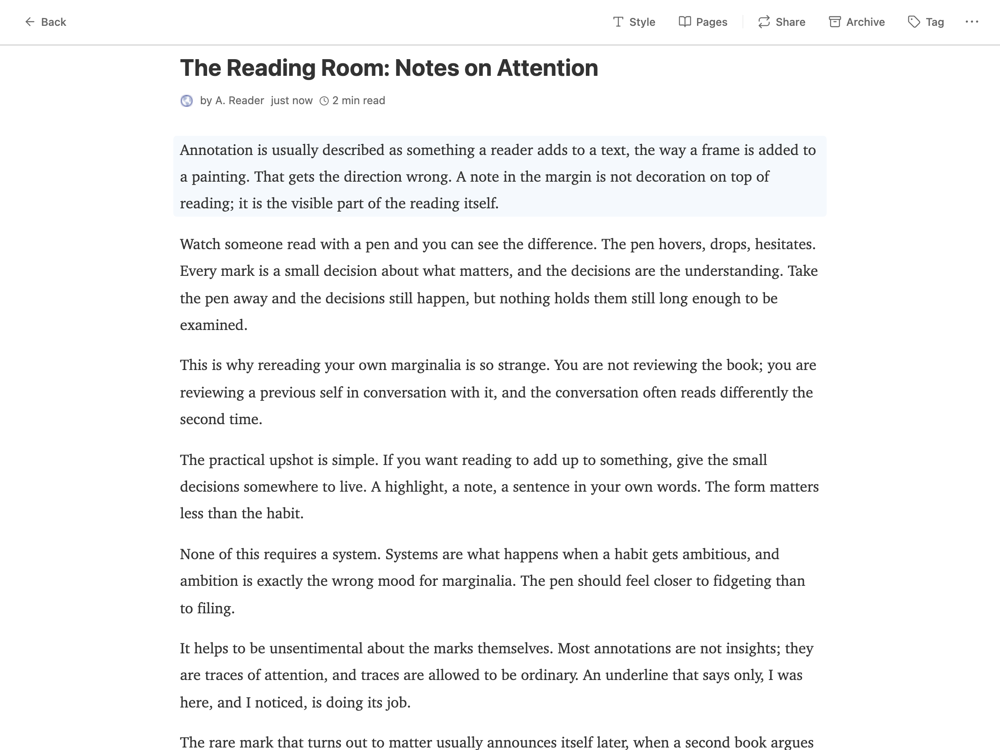
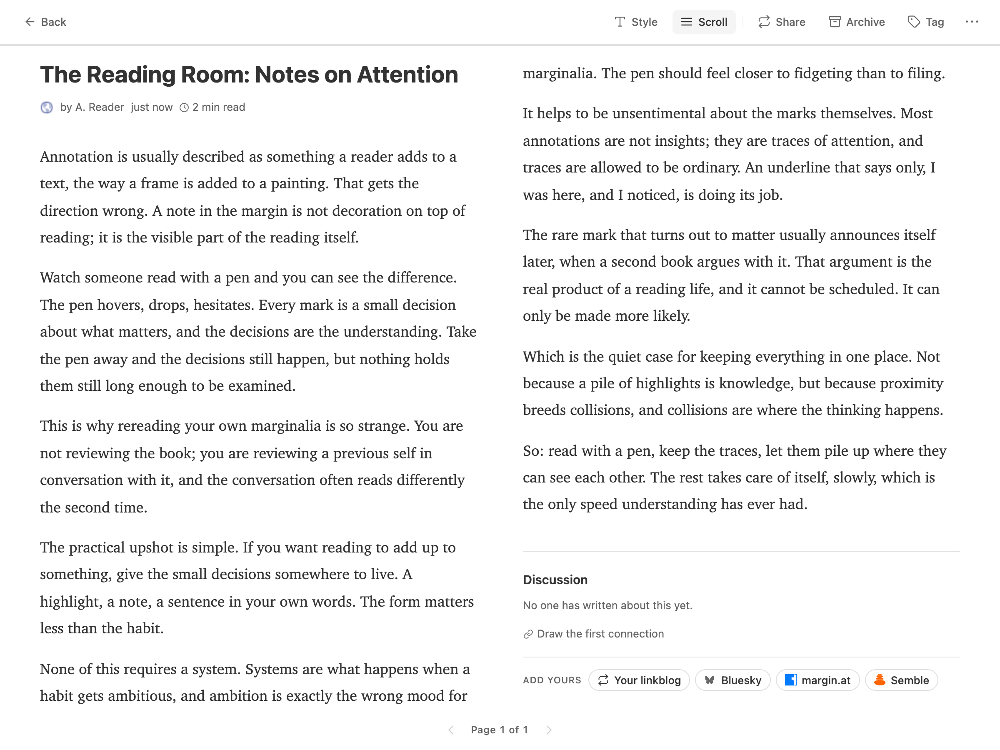
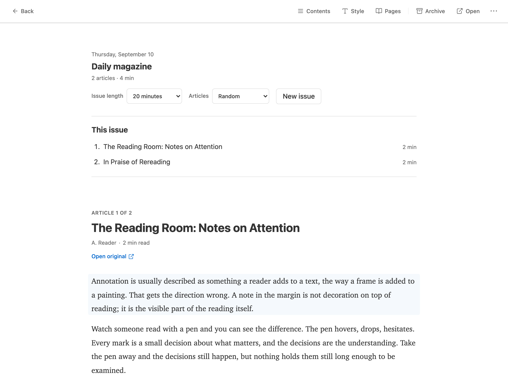

## The library

**Feeds** shows everything you follow in one chronological stream. The sidebar lists your sources and channels; **channels** are saved views over the library, filtered by source, content type, or read state, so "Newsletters" or "Slow reads" is one click away.

Items you scroll past can be marked read automatically (a toggle in **Settings → Reading**).

**Home** is the calmer front page: pick up where you left off, recent saves, your daily magazine.

## The reader

Opening an article gives you a clean, full-screen reading surface. 

- **Style customization** : change the font style and size.
- **Paged mode**: a toggle in the reader switches from scrolling to page turns, one page at a time, or two columns side by side on a wide screen. 
- **Highlighting**: double-click a paragraph or select text. See [Saving and highlights](/guide/saving-and-highlights/).

## Discussion

Articles carry a **Discussion** section at the end that gathers what people across the Atmosphere have written about that link: linkblog notes, Leaflet comments, Bluesky posts, Margin annotations, Semble connections, merged into one stream. 

## The daily magazine

**Daily** builds a magazine issue from your saved articles. Pick an issue length in minutes and an ordering, then **Generate issue**. An issue is a snapshot: new saves don't reshuffle it, and it resumes where you left off on any device. When you finish, archive the issue or generate a new one from the current pile.

## Offline

Your feeds, saves, and highlights are stored on your device. Reading, marking read, highlighting, and the magazine all work offline; anything you do is queued and synced when you reconnect. Adding sources and changing sync settings need a connection.
