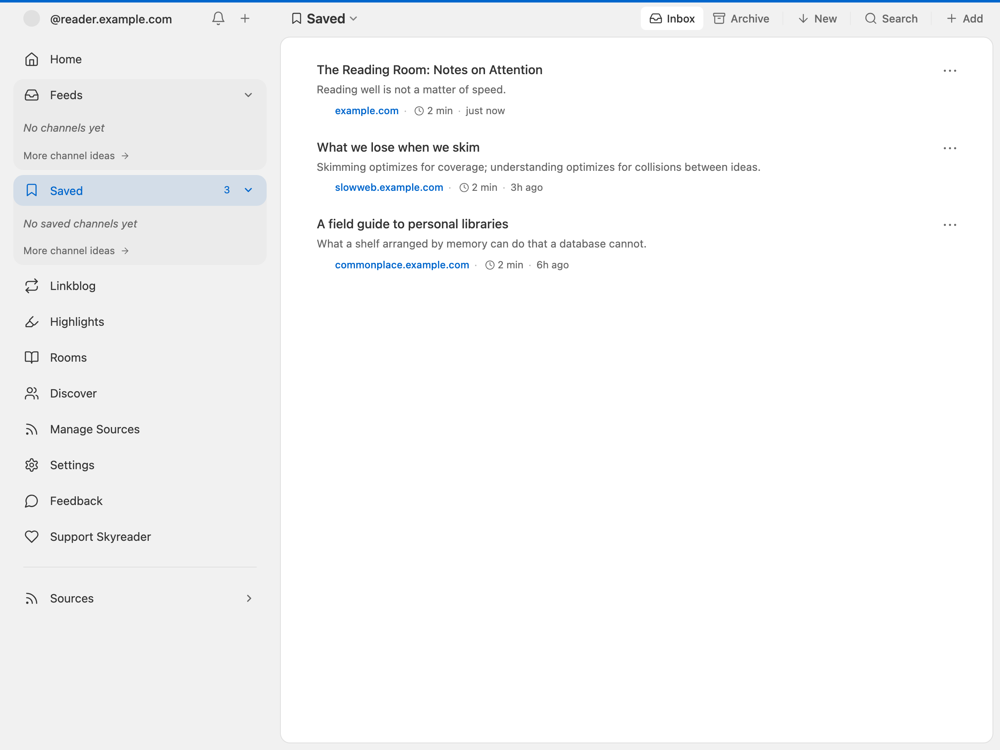
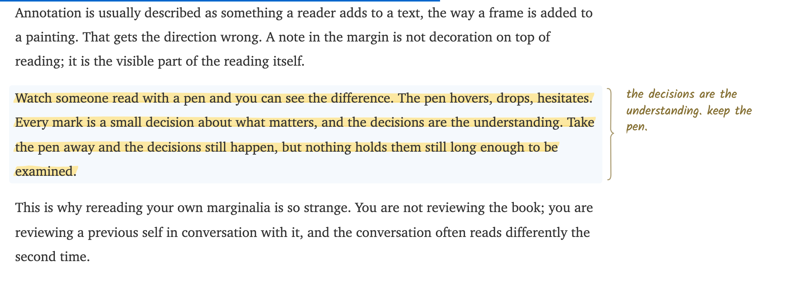
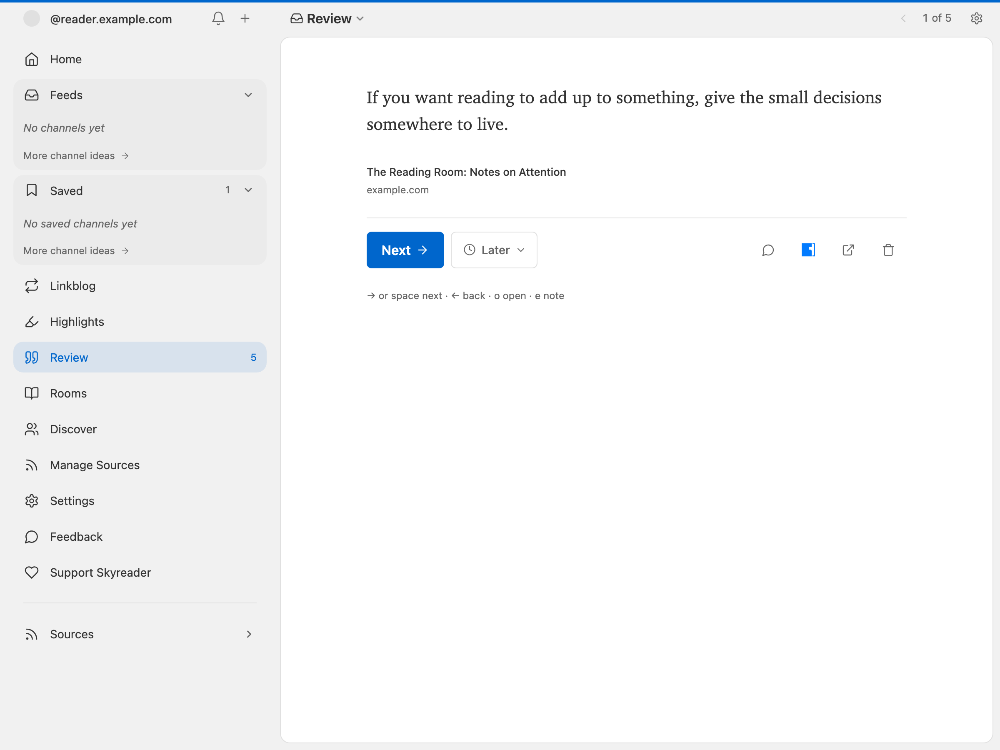

## Saving

Save an article from its card or from the reader, or from outside Skyreader entirely: the [Chrome extension](https://chromewebstore.google.com/detail/skyreader/kdefpnnpmajcclfepekgdkcdiklfooed), the bookmarklet, the iOS shortcut, or the Android share sheet (see [Adding sources](/guide/adding-sources/#save-and-subscribe-from-anywhere)). Saves keep the full article text, so they read fine offline.

Saves are **private to Skyreader** by default. Nothing is published.

### When a site won't let Skyreader read it

Some sites refuse automated readers, so Skyreader's servers can't fetch the article even though it opens fine in your browser. Skyreader will say so and point you at the extension, which reads the page you already have open. That gets you the full text where a plain URL save can't.

### Backing your saves with Semble or Margin

If you use [Semble](https://semble.so) or [Margin](https://margin.at), you can back your Saved list with one of them (**Settings → Saved articles**). Your Saved list becomes a collection there: edit it in either app, or in any Atmospheric app, and the two stay in sync.

One thing to know before turning it on: **backing publishes all of your saves publicly**, because Semble and Margin collections are public.

## Highlights

While reading, double-click a paragraph or select text to highlight it. Drag the handles at either end to adjust what a highlight covers.

### Notes in the margin

Notes live beside the text, the way they would in a book. On a wide screen, every highlight gets a small bracket in the margin. Click the bracket (or choose **Note** after selecting text) and write right there, next to the passage. Your note saves when you click away or press Escape.

On a phone, or when reading in pages, there's no margin to write in. An asterisk after a passage means it has a note: tap it and the note unfolds under the paragraph.

Other readers' notes from Margin appear in the left margin, in pencil, when **Community highlights** is on.

Highlights are private to Skyreader and sync across your devices. Two optional Margin connections exist, in both directions:

- **Save to Margin** publishes a single highlight as a note on your public PDS. It's per-highlight and explicit; nothing is published unless you choose it.
- **Bring in highlights from Margin** (**Settings → Highlights**) adds your existing Margin highlights to your review deck here.
- **Community highlights** (**Settings → Reading**) shows passages other readers highlighted on Margin while you read saved articles.

## The review deck

The **Highlights** page collects every highlight, grouped by article. Its **Review** deck deals you a small handful at a time, so old highlights resurface instead of piling up. Each highlight carries a review intent: **soon**, **later**, **someday**, or **never** (kept, but out of rotation). A few keys drive the whole deck: arrow keys to move, `e` to edit the note, `o` to open the article.

## Limits

The free plan includes 100 URL saves a month (saving from the web, your phone, or the extension); Supporters get 1,000. See [Supporter](/supporter/).
