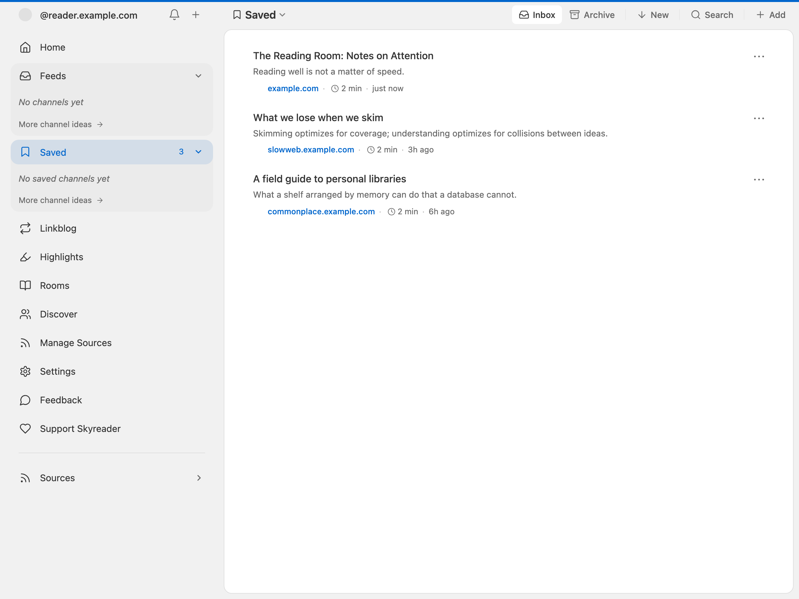
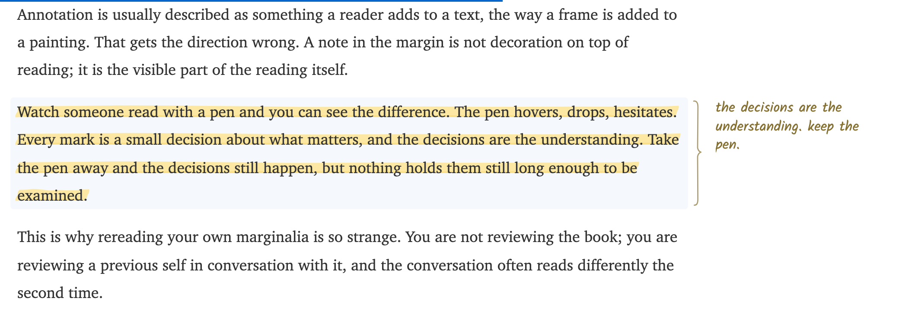
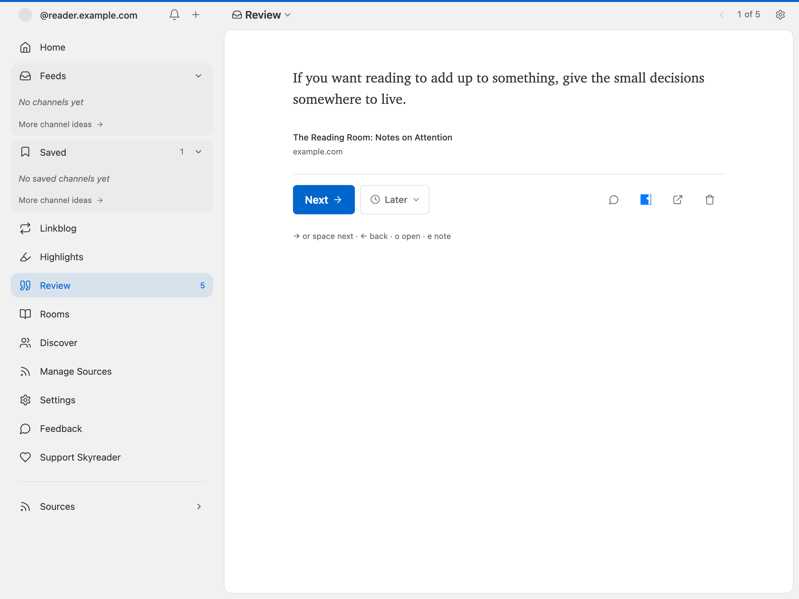

## Saving

Save an article from its card or from the reader, or from outside Skyreader entirely: the [Chrome extension](https://chromewebstore.google.com/detail/skyreader/kdefpnnpmajcclfepekgdkcdiklfooed), the bookmarklet, the iOS shortcut, or the Android share sheet (see [Adding sources](/guide/adding-sources/#save-and-subscribe-from-anywhere)). Saves keep the full article text, so they read fine offline.

Saves are **private to Skyreader** by default. Nothing is published.

### Saving a link from inside an article

Tap a link in an article to see where it goes before you leave. From there you can open it, copy it, save it to Skyreader, or add it to a [Semble](https://semble.so) or [Margin](https://margin.at) collection. Semble and Margin collections are public.

### Filing into Semble and Margin collections

The collections you use most sit at the top of the picker. Star a collection to keep it there; the ones you used most recently join it. To find any other collection, type part of its name. Press Enter to add the top match, and ⌘ Enter (Ctrl Enter on Windows and Linux) to save.

If the article is already in Semble or Margin, the picker opens on the collections it's in, so you can move it rather than save it twice.

### When a site won't let Skyreader read it

Some sites refuse automated readers, so Skyreader's servers can't fetch the article even though it opens fine in your browser. The save still goes through: you get the link (and its title, when Skyreader knows it) with a note in place of the text. To get the full text, open the article and save it with the [Chrome](https://chromewebstore.google.com/detail/skyreader/kdefpnnpmajcclfepekgdkcdiklfooed) or [Firefox](https://addons.mozilla.org/firefox/addon/skyreader/) extension, which reads the page you already have open. That replaces the note.

### Backing your saves with Semble or Margin

If you use [Semble](https://semble.so) or [Margin](https://margin.at), you can back your Saved list with one of them (**Settings → Library & privacy → Saved articles**). Your Saved list becomes a collection there: edit it in either app, or in any Atmospheric app, and the two stay in sync.

One thing to know before turning it on: **backing publishes your saves publicly**, because Semble and Margin collections are public. Saved newsletters are the exception: they have no web link to share, so they stay private to Skyreader.

## Highlights

While reading, double-click a paragraph or select text to highlight it. Drag the handles at either end to adjust what a highlight covers.

### Notes in the margin

Notes live beside the text, the way they would in a book. On a wide screen, every highlight gets a small bracket in the margin. Click the bracket (or choose **Note** after selecting text) and write right there, next to the passage. Your note saves when you click away or press Escape.

On a phone, or when reading in pages, there's no margin to write in. An asterisk after a passage means it has a note: tap it and the note unfolds under the paragraph.

Other readers' notes from Margin appear in the left margin, in pencil, when **Community highlights** is on.

Highlights are private to Skyreader and sync across your devices. Two optional Margin connections exist, in both directions:

- **Publish** puts a single highlight, and its note, on [Margin](https://margin.at), where anyone can see it. It's per-highlight and explicit; nothing is published unless you choose it.
- **Bring in highlights from Margin** (**Settings → Reading → Highlights**) adds your existing Margin highlights to your review deck here.
- **Community highlights** (**Settings → Reading → Highlights**) shows passages other readers highlighted on Margin while you read saved articles.

### Posting a highlight to Bluesky

Choose the Bluesky button on a highlight (in the reader, the **Highlights** page, or the review deck) to post it from your own account. In the reader, the button is there as soon as you select text, so you can post a passage without highlighting it first. The first time, Skyreader asks for permission to post for you.

The passage goes out as an image (a text shot): the quote set in the article's type, signed with the article's title and site, with the quote itself as the image's description. Your note becomes the post's text, which you can edit before posting; the article's link rides in the text. Switch **Quote as** to **Text** to quote the passage in the text instead, with the article's link card. Either way the post holds 300 characters; a ring appears as you near the limit.

Once posted, it's a public Bluesky post like any other: manage it in Bluesky.

## The review deck

The **Highlights** page collects every highlight, grouped by article. Its **Review** deck deals you a small handful at a time, so old highlights resurface instead of piling up. Each highlight carries a review intent: **soon**, **later**, **someday**, or **never** (kept, but out of rotation). A few keys drive the whole deck: arrow keys to move, `e` to edit the note, `o` to open the article.

## Limits

The free plan includes 100 URL saves a month (saving from the web, your phone, or the extension); Supporters get 1,000. See [Supporter](/supporter/).
