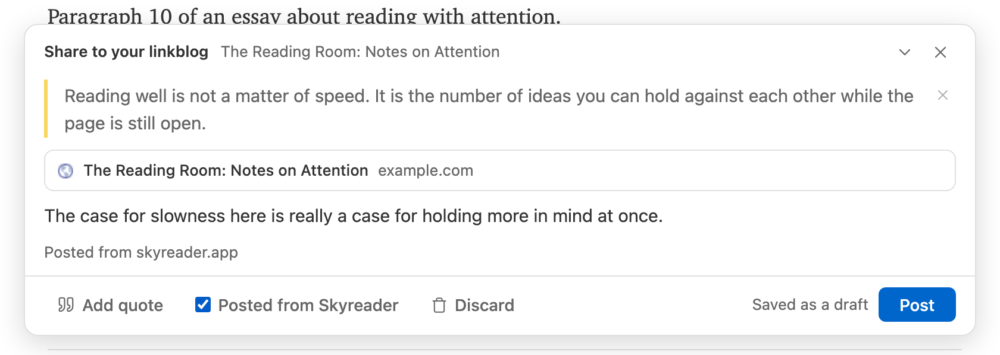
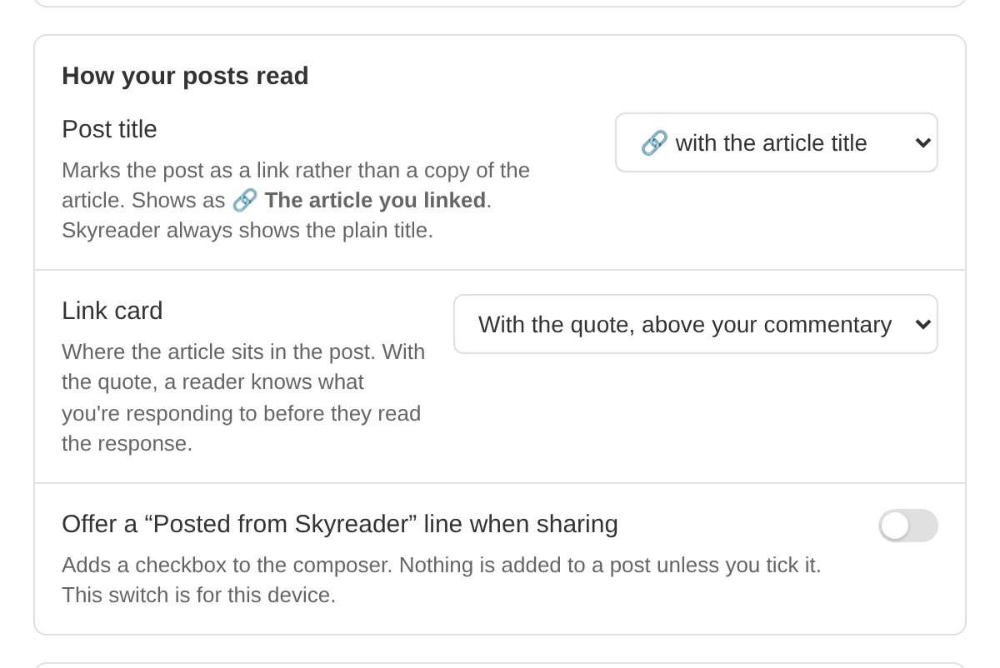

Sharing in Skyreader means posting a link, with your commentary, to your **linkblog**: a public publication that anyone can read, follow, or subscribe to by RSS.

## The composer

**Share** on any article opens the composer, a card docked at the bottom of the screen. The article stays readable behind it, so you can draft on one side and gather quotes with the other, and you can minimize the composer to a slim bar while you read.

A post is your commentary plus any **quoted passages** you pull in. The quote picker offers your highlights on that article, shown with their surrounding context, and the article's own excerpt. Drafts save locally as you type and survive closing the reader; nothing is public until you choose **Post**.

You can edit a post's note after publishing, or take a post down.

## Also posting to Bluesky

Tick **Also on Bluesky** in the composer to post the share to Bluesky as well, from your own account. The box stays ticked for your next share until you untick it. The first time, Skyreader asks for permission to post for you.

A Bluesky post holds 300 characters, so the composer shows what yours will carry before you post:

- **Your commentary** becomes the post's text, trimmed to fit if it runs long.
- **Quoted passages** go out as images (text shots): each quote set in the article's type, signed with the article's title and site. Bluesky takes up to four. The image's description is the quote itself, so it stays readable to screen readers. Untick **Quotes as images** to put the quotes in the text instead.
- **The link.** Without images, the post carries the article's link card. With them, Bluesky can't show a card too, so the link goes in the text.

The Bluesky post is separate from your linkblog post: editing or removing the share here doesn't change it. Manage it in Bluesky.

## Where your linkblog lives

Your linkblog is a publication stored in your PDS, which means it's yours in a concrete way: it's readable across the Atmosphere and it outlives Skyreader.

Every linkblog gets a public page at `linkblogs.skyreader.app/your-handle`, with its own RSS feed, so anyone can follow it, in Skyreader or in any feed reader.

If you already publish on the Atmosphere, you can point sharing at a standard.site publication you own (in Leaflet or similar) instead of the Skyreader-made one (**Settings → Linkblog**). An optional toggle keeps a page of just your links on linkblogs.skyreader.app.

## How your posts read

Your link posts are Atmosphere records, so other apps can render them too. On a connected publication they sit beside that site's own writing. **Settings → Linkblog** shapes how a post reads:

- **Post title.** Marks the post as a link rather than a copy of the article: 🔗 before the article title (the default), the title in quotes, or the title exactly as written. The marker is for other apps; Skyreader and your linkblog page always show the plain title.
- **Link card.** Where the article's card sits in the post: with the quote, above your commentary (the default), first, or last. With the quote, a reader knows what you're responding to before they read the response. The composer draws the card where the published post will put it.

Changing either applies to new posts; posts you already published keep the shape they were written in.

If you'd like your posts to say where they came from, turn on **Offer a "Posted from Skyreader" line when sharing**. That adds a checkbox to the composer.

## What's public

Shared links are **always public**. That's the one part of Skyreader that is public by design; everything else you do while reading is private by default (see [Your data](/your-data/)).

Deleting your linkblog removes every link post from your PDS. You can restore the linkblog afterward to start sharing again, but deleted posts don't come back.
