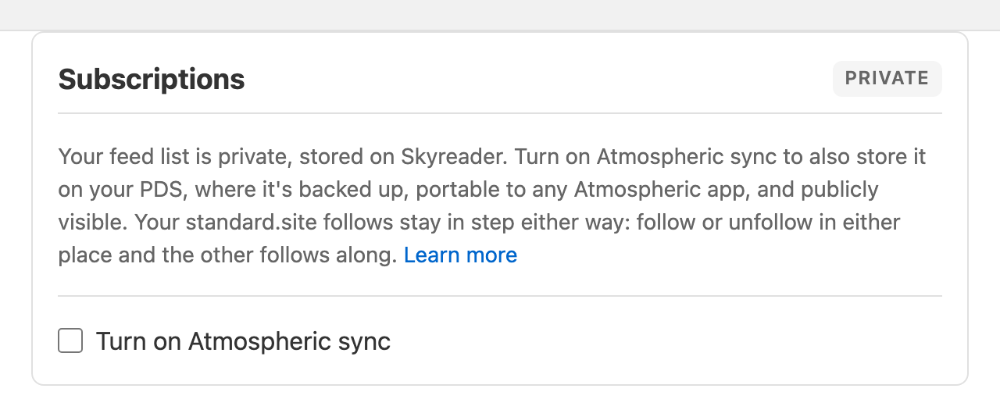

The short version: **your reading is private to you by default.** A few things are public, or can be made public, so they're portable across the Atmosphere.

## At a glance

| What                    | Where it lives                                 | Visibility                                        |
| ----------------------- | ---------------------------------------------- | ------------------------------------------------- |
| Read state              | Skyreader's servers + your devices             | Private                                           |
| Subscriptions           | Skyreader's servers (+ your PDS if you opt in) | Private; public if Atmospheric sync is on         |
| Saved articles          | Skyreader's servers + your devices             | Private; public if backed by Semble or Margin     |
| Highlights and notes    | Skyreader's servers + your devices             | Private; a highlight you Save to Margin is public |
| Shared links (linkblog) | Your PDS                                       | Always public                                     |
| Guest data              | Your device only                               | Private                                           |

## Subscriptions and Atmospheric sync

Your feed list is private, stored on Skyreader. Turning on **Atmospheric sync** (**Settings → Subscriptions**) also stores it on your PDS, where it's backed up, portable to any Atmospheric app, and **publicly visible**. That last part is the tradeoff to weigh: sync makes your subscription list something anyone can look up.

Sync covers subscriptions. It does not touch your saves, highlights, or read state.

Either way, you can walk away with your list at any time: **Settings → Import / Export → Export OPML**.

## Saved articles

Saves live on Skyreader, private to you. They are **not** stored on your PDS.

The one way a save becomes public is choosing it: backing your Saved list with **Semble or Margin** (**Settings → Saved articles**) turns the list into a public collection in that app.

## Highlights and notes

Highlights are private to Skyreader and sync across your devices through Skyreader, not through your PDS.

If you'd like to share a highlight publicly, you can share an individual highlight to **Margin**, which publishes that one highlight to your public PDS.

## Your linkblog

Shared links are always public. That's their point: a linkblog is a publication in your PDS, readable across the Atmosphere, with a public page and RSS feed. See [Sharing](/guide/sharing-and-your-linkblog/).

## Seeing for yourself

The Atmosphere is inspectable. **Settings → Privacy & sharing** links to a viewer showing everything in your public PDS data, so you can verify what's there rather than take this page's word for it.

## Guests

Guest reading stores everything on your device. Nothing leaves it until you sign in, at which point your saves, highlights, and read state migrate to your account.
